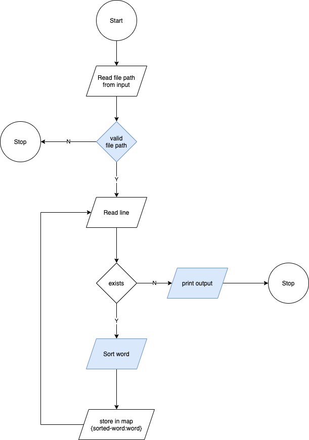

# Find the anagrams
Solving problems is fun to keep your inner developer alive.
And what better fun than writing a program that finds anagrams in a file.

## The idea
There is a file containing one word per line. The program takes the path to the file as an argument. It will then scan the file, group the words that are anagrams to each other and write to the standard output each of these groups. Initial considerations are:
* There is one word per line
* The words are ordered by size.
* Each word can be loaded safely into memory
* The words are not necessarily actual English words, for example, “abc” and “cba”
* The order of the groups in the output does not matter
* Printed groups will be separated by newlines. And the words inside each group, seperated by commas.

<br/>

- [Find the anagrams](#find-the-anagrams)
  - [The idea](#the-idea)
  - [The solution](#the-solution)
    - [Input/Output considerations](#inputoutput-considerations)
    - [Data structures](#data-structures)
    - [Sorting words](#sorting-words)
    - [Error handling](#error-handling)
    - [Big O analysis](#big-o-analysis)
    - [Improvements](#improvements)
  - [How to run](#how-to-run)
<br/><br/>

## The solution
Considering there is no need to interface with network communications, the application will be a standard console application, executed via the command line. It can be built in the most common runtime environments like the ones for, C#, Ruby, Python and so on. The choice I made is based on the most recent one I worked with which is *Javascript*.

The solution will be implemented with **Node 14** and tested with **Mocha**, using **Chai** as the assertion library.

Following diagram represents the overal flow for the program:



### Input/Output considerations
While implementing the solution some considerations were made:
* Words are in `locale('en')`
* File size is restricted to 10MB.
   * In theory, larger files could be processed. But its a good practice for a system to have a limit on its inputs.
   * The size could have been determined by load testing the program for several sizes and choosing the size that is 30% bellow the point of failure. But the approcach taken was to consider a size restriction that most of us are used to. The maximum size that most email clients accecpt for an attachment.
* The anagram's group of words output will not containt duplicates. For instance, the program will produce `fun, unf, nuf` rather than `fun, fun, unf, nuf, fun`

### Data structures
The program's idea is to group anagrams, and in order to do this, we need to identify the anagram of a group so we can add more words to it. In other words we need JavaScript's **HashMap(Map)** where the key is the group's sorted anagram and the value is the actual group of words. And considering the main activity of the program will be to search and insert, this structure offers `O(1)` complexity for these operations.

The group of words is being stored in an **Array** considering its a structure designed to grow in size as elements are added.

### Sorting words
This is the hashing algorithm for the HashMap mentioned above. It doesn't focus on sorting it alphabeticaly but rather on the UTF-16 code value of the word. As an example, if its given `cBa` it will produce `Bac` and not `aBc`. I just need it to be consistent, not alphabeticaly corret. Followng the example, if its given `caB` it will still produce `Bac`.

> Please notice that if the word is `äBć` we're not expecting the sort result `Bäć` to match `Bac` in the HashMap. They are different words from a UTF-16 code value. We are expecting however `ćäB` to be sorted to `Bäć` and match it in the HashMap.

Other points to note in the algorithm are:

* Used spread syntax to initialise an Array with all the characters of the string rather than split('') to avoid destroying surrogate pairs as mentioned [here](https://developer.mozilla.org/en-US/docs/Web/JavaScript/Reference/Global_Objects/String/split#parameters)
* Used the default sort method of the array to keep things simple and to be honest, the V8 community can do a better job than me. But being curious as I am, I [discovered](https://github.com/v8/v8/blob/master/third_party/v8/builtins/array-sort.tq) that its using [TimSort](https://hackernoon.com/timsort-the-fastest-sorting-algorithm-youve-never-heard-of-36b28417f399), a very fast , O(n log n), stable sorting algorithm
* Used the default string comparison which orders by UTF-16 code value allowing us to sort as stated above. And to be honest, since the word sorter is going to be used for every word in the file, not using an [Intl.Collator obj]((https://developer.mozilla.org/en-US/docs/Web/JavaScript/Reference/Global_Objects/Array/sort#sorting_non-ascii_characters)) and dealing with its restriction on [large arrays](https://developer.mozilla.org/en-US/docs/Web/JavaScript/Reference/Global_Objects/String/localeCompare#performance) to ensure alphabetic accuracy, its actually a less complex solution.

### Error handling
Used try/catch block in the areas of the code where (in theory) we can resume operation. A load test would allow us to prove this theory.

Used a listener on the uncaughtException event for terminating errors where we want to relinquish control over the file.

### Big O analysis
I'll start by analysing the time complexity and then I'll move into the space complexity. I'll be assuming the worst scenarios

**Time complexity:**
* Reading each line of the file is of linear complexity O(n)
* Sorting words is:
   * Linear complexity for string->array and array->string O(2n)~O(n)
   * Linearithmic complexity for sorting O(n logn)
* Searching the array to check if the value is included is Linear complexity O(n)

> According to the four rules of Big O, the time complexity equates to O(n logn).

**Space complexity:**
* Sorting words will create an array and a string for each word making it of linear complexity O(2n)~O(n)
* Creating groups of anagrams will be one entry per word, growing the Map in a linear complexity O(n)

### Improvements
Given more time I'd like to:
* Improve the use experience by interacting with the user for next steps rather than one time execution as is now.
* Perform a load test to understand the real capacity of the application.

## How to run
Start by ensuring you have Node14 and npm6 installed in your machine. Then in the command line execute the following commands
```
> cd <path-to-src-code>
> npm i
> npm run tests
> node . example-files/example2.txt
```

Considering that the output might not fit your console, you could
```
> node . example-files/example2.txt > output.file
```